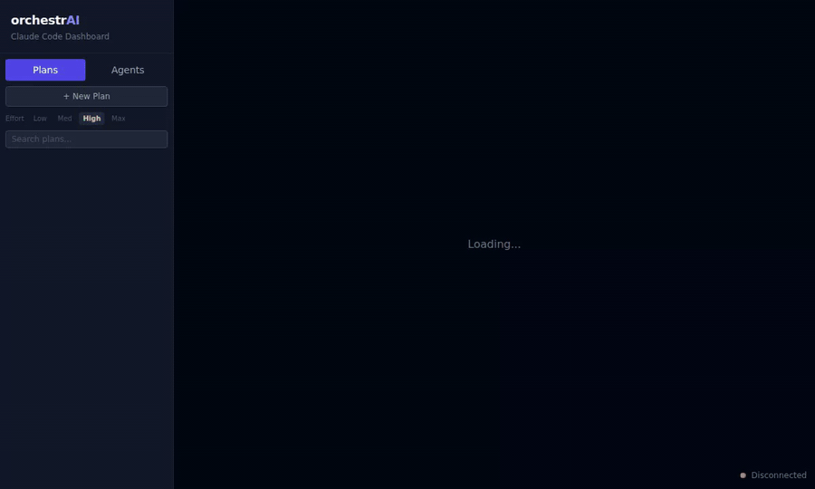
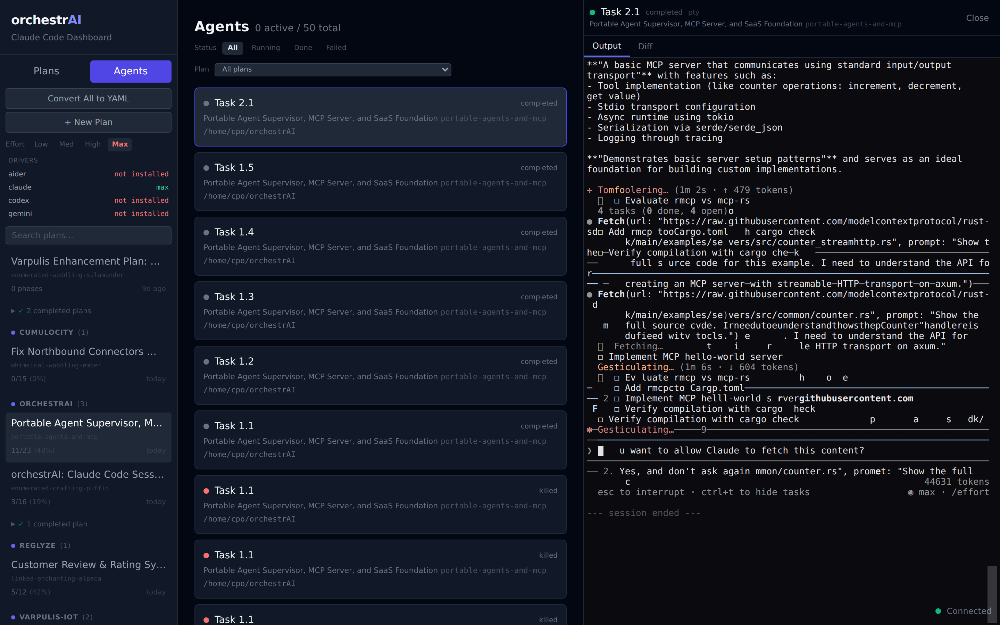
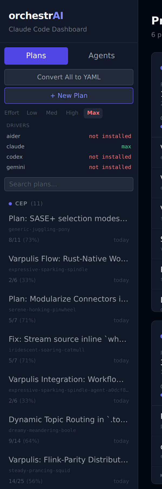

# orchestrAI

**Your Claude Code sessions, on any screen.** Run orchestrAI on your workstation, open the dashboard from your laptop, your phone, a hotel TV — anywhere your browser can reach the host — and you're in a live terminal with a real Claude Code agent working on your codebase.



Plans live as YAML in `~/.claude/plans/`. Every task has a Start button. Click it and a Claude agent spins up on a dedicated git branch, you watch it work, type to it, and when it's done you review the diff and merge — all from the browser.

---

## Why it exists

Most AI coding tools run inside an editor on one machine. orchestrAI turns your machine into a control plane: your plans, your agents, your git branches, your terminals — all remotely accessible, persistent across server restarts, and organized around the work you're actually trying to ship.

It is a **project-management layer for AI agents**. Like Linear/Jira, except:

- assignees are AI agents (Claude Code today, Aider/Codex/Gemini as drivers)
- status updates come from the code and git, not from someone typing them
- "complete a task" means: spawn an agent on a branch, watch it, review the diff, merge

Ships as a single ~15 MB Rust binary. No Node, no Docker, no daemon to install separately.

---

## Screenshots

### Plan board — collapsible phases, live status


### Agent terminal — full Claude Code session in the browser


### New plan — describe, pick a folder, an agent creates the plan


### Sidebar — projects, driver auth status, effort level


---

## What it does

**Interactive agent sessions from any browser.**  Spawn a Claude Code (or Aider, Codex, Gemini) agent for a task. Get a real xterm.js terminal, type at it, watch tool calls in real time. Sessions persist across server restarts — kill orchestrAI, restart it, the agent is still working and the terminal reattaches.

**Plans as YAML, not parsed markdown guesses.** Each plan lives in `~/.claude/plans/*.yaml` with phases, tasks, dependencies, file paths, acceptance criteria. Inline-editable from the UI. One-click migration from legacy `.md` plans.

**Git-isolated changes with review before merge.** Each agent works on `orchestrai/<plan>/<task>`. When it finishes, the task card shows a diff tab, the branch name, and a Merge button. Nothing lands on your working branch until you click it.

**Check agents.** One-click "is this task actually done?" — spawns a read-only agent that reads the code and replies with a verdict. No heuristics, no false positives.

**Multi-AI via drivers.** Each AI CLI has a driver defining its binary, prompt format, ready signal, cost parser, graceful-exit sequence, and auth-detection logic. Start button is disabled for drivers that aren't authenticated, with the exact command to fix it shown in the tooltip.

**Cost tracking.** Per-agent USD reported by the CLI, aggregated per task and per plan. Budget limits per task.

**CI integration.** If your repo has GitHub Actions, each task's badge shows the CI status for the commit that landed its merge.

**Real-time by default.** WebSocket updates for agent output, task status, CI, plan file changes. Desktop notifications when agents finish.

**Supervised sessions, no tmux.** Each interactive agent runs inside a detached supervisor daemon spawned as `orchestrai-server session --socket <path>`. The daemon owns the PTY and exposes the session over a Unix socket (Linux/macOS) or named pipe (Windows). PTY output is mirrored to `<socket>.log` so reconnecting clients get the full transcript. No external dependency.

---

## Build from source

Requires Rust 1.85+, Node.js 20+, and pnpm.

```sh
# Build frontend
pnpm --filter @orchestrai/web build

# Build server (embeds frontend via rust-embed)
cd server-rs && cargo build --release
```

Binary: `server-rs/target/release/orchestrai-server`. Single file, ~15 MB, no runtime dependencies.

## Run it

```sh
orchestrai-server [OPTIONS]
```

| Flag           | Default     | Description                                          |
|----------------|-------------|------------------------------------------------------|
| `--port`       | `3100`      | HTTP port                                            |
| `--effort`     | `high`      | Default effort for agents (`low`, `medium`, `high`, `max`) |
| `--claude-dir` | `~/.claude` | Path to `.claude` directory                          |

Open `http://<host>:3100` in any browser on your network. Nothing else to install.

### Prerequisites on the server machine

- At least one supported AI CLI installed and authenticated:
  - **Claude Code** (`claude`) — run `claude` once and complete OAuth login, or export `ANTHROPIC_API_KEY`
  - Or: Aider, Codex, Gemini (their respective API keys)
- Git (for branch isolation — orchestrAI auto-inits repos that don't have one)

## Project structure

```
orchestrAI/
  server-rs/      Rust server (Axum, rusqlite, portable-pty, interprocess)
  web/            React frontend (Vite, Tailwind, xterm.js, Zustand)
  screenshots/    Dashboard screenshots + demo recording
```

## License

MIT
