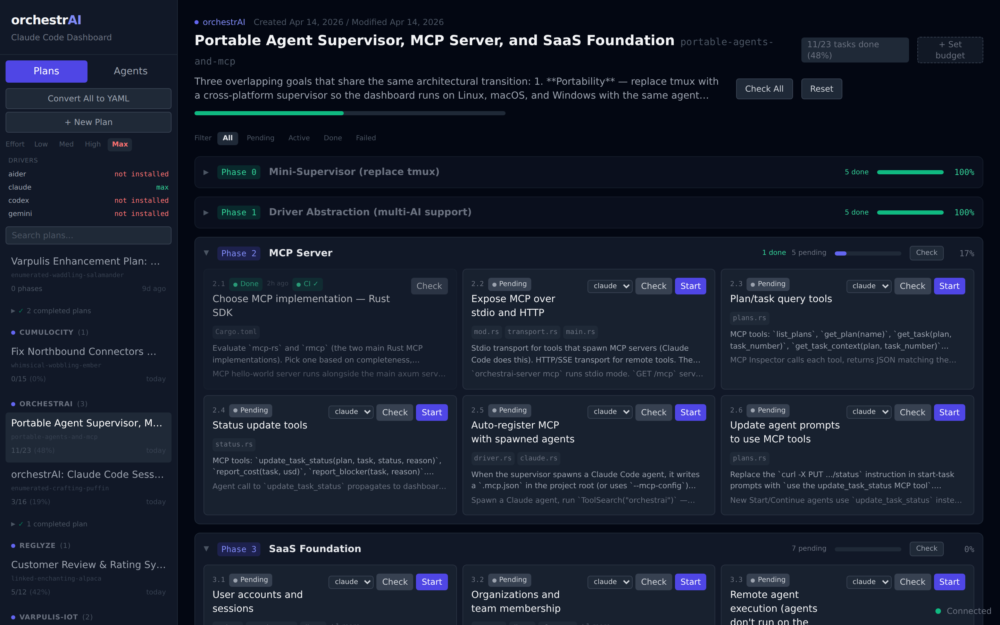
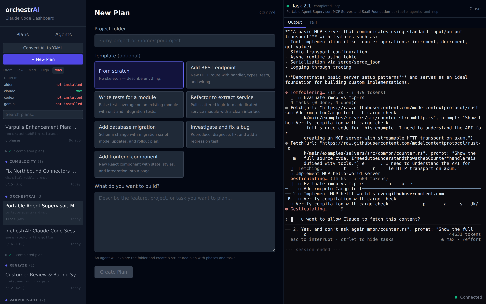

# orchestrAI

A control plane for Claude Code agents. Visualize plans, track task progress, spawn interactive agent sessions, review diffs, and approve changes — from a single self-contained Rust binary.

## Screenshots

**Plan Board** — Collapsible phase cards with task status, progress bars, and inline editing:



**Agents** — All running and completed agents with status/plan filters:


**New Plan** — Describe what to build, pick a folder, agent creates a structured plan:



**Sidebar** — Plans grouped by project, effort selector, YAML conversion, search:


## Features

### Plan Management
- **Plan Board**: Parses `~/.claude/plans/*.md` and `.yaml` into collapsible phase cards with task grids
- **Auto-status detection**: Scans project files and git history to infer task completion
- **YAML plans**: Structured plan format with one-click conversion from markdown
- **Inline editing**: Edit plan titles, context, task descriptions, and acceptance criteria directly in the dashboard
- **Project inference**: Automatically links plans to project directories from file paths
- **Plan creation**: Describe what you want, pick a folder, an agent creates the plan

### Agent Orchestration
- **Interactive terminals**: Start/Continue/Retry tasks via real Claude Code sessions (tmux + xterm.js)
- **Check agents**: One-click verification — spawns a read-only agent to check if a task is done
- **Agent persistence**: Agents survive server restarts (tmux sessions auto-reattach)
- **Effort control**: Global effort level (Low/Med/High/Max) applied to all spawned agents

### Git Integration
- **Branch isolation**: Each agent works on a dedicated git branch
- **Diff view**: See exactly what files an agent changed (unified diff in the agent panel)
- **Approval workflow**: Review diffs, then merge or discard — changes only land when you approve
- **Base commit tracking**: Diffs are computed against the commit at agent start

### Real-time Dashboard
- **WebSocket updates**: Task status changes, agent output, and plan modifications push instantly
- **In-place updates**: Status changes patch the UI without full-screen refresh
- **Embedded frontend**: Single binary serves the React dashboard — no separate web server
- **Hook receiver**: `POST /hooks` endpoint for Claude Code hook events from external sessions

## Build from source

Requires Rust 1.85+, Node.js 20+, pnpm, and tmux.

```sh
# Build frontend
pnpm --filter @orchestrai/web build

# Build server (embeds frontend)
cd server-rs && cargo build --release
```

Binary: `server-rs/target/release/orchestrai-server` (~10 MB, zero runtime dependencies)

## Usage

```sh
orchestrai-server [OPTIONS]
```

| Flag           | Default     | Description                                          |
|----------------|-------------|------------------------------------------------------|
| `--port`       | `3100`      | HTTP port                                            |
| `--effort`     | `high`      | Effort level for agents (`low`, `medium`, `high`, `max`) |
| `--claude-dir` | `~/.claude` | Path to `.claude` directory                          |

Open `http://localhost:3100` in your browser.

### Prerequisites

- **tmux** — used for persistent agent terminal sessions
- **claude** CLI — Claude Code must be installed and authenticated

## Project structure

```
orchestrAI/
  server-rs/      Rust server (Axum, rusqlite, portable-pty, tmux)
  web/            React frontend (Vite, Tailwind, xterm.js, Zustand)
  screenshots/    Dashboard screenshots (Playwright)
```

## License

MIT
