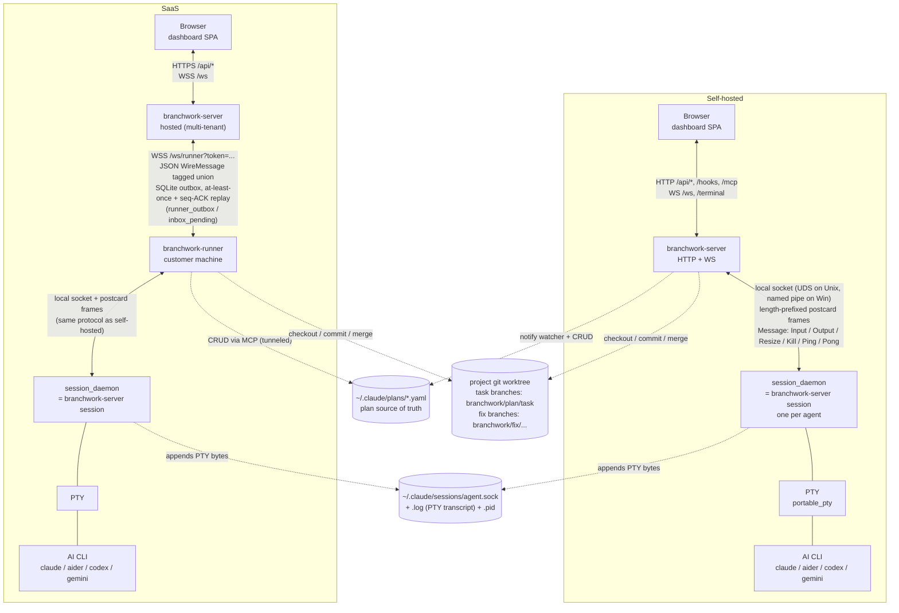

# Architecture overview

Branchwork ships as three cooperating binaries. The diagram below shows
both deployment shapes on one canvas so the runner's place in the SaaS
path is easy to compare against the self-hosted path; everything after
the diagram fleshes out what each binary owns and walks a single
end-to-end "Start task" click through both modes.

## Component diagram

## Legend

| Line | Meaning |
|------|---------|
| Solid arrow `<-->` | Live bidirectional channel (HTTP, WebSocket, or local socket). |
| Solid line `---` | In-process handoff (file descriptor, spawn). |
| Dashed arrow `-.->` | Filesystem read or write (not a live connection). |

## The three binaries

### `branchwork-server` — the dashboard

`branchwork-server` is the web tier and the only binary the user
interacts with directly. It serves the SPA, the HTTP API (`/api/*` for
plans, agents, CI, billing, auth; `/hooks` for inbound Claude tool-use
hooks; `/mcp` for Model Context Protocol tooling), and three
WebSockets: `/ws` broadcasts dashboard events (`agent_started`,
`agent_output`, `task_status_changed`, `plan_updated`, `plan_checked`,
…) to every browser tab, `/terminal` streams a single agent's PTY to
xterm.js, and `/ws/runner` is the SaaS-only authenticated channel that
remote runners connect outbound to. The same binary also embeds the
session-daemon code under the `branchwork-server session` subcommand
([`supervisor.rs`](../../server-rs/src/agents/supervisor.rs)), so a
single deployment artifact covers both the dashboard and the per-agent
supervisor. State that has to outlive the process — agent rows, task
status, cost, runner outbox — lives in SQLite (Postgres in the Helm
chart); plans themselves live on disk as YAML.

### `session_daemon` — one PTY per agent

`session_daemon` is the durable home of a single AI-CLI process. The
server (or runner, in SaaS) spawns one daemon per agent via the
`branchwork-server session` subcommand, the daemon `fork`+`setsid`s
itself on Unix (or is launched with `DETACHED_PROCESS` on Windows) so
its parent can die without taking it down, and then it owns the PTY
master, runs the CLI command (`claude`, `aider`, `codex`, `gemini`)
inside it, and listens on a local IPC socket — a Unix domain socket
under `~/.claude/sessions/<agent>.sock` on Unix, a named pipe
`\\.\pipe\oai-<stem>` on Windows. The wire format is
length-prefixed postcard-encoded
[`Message`](../../server-rs/src/agents/session_protocol.rs) frames
(`Input` / `Output` / `Resize` / `Kill` / `Ping` / `Pong`, capped at
8 MiB), and every byte the PTY emits is also appended to a `<socket>.log`
transcript so a reconnecting client gets the full scrollback. The
daemon and the `session` subcommand are the same code reached two
different ways: the `session_daemon` binary in
[`src/bin/session_daemon.rs`](../../server-rs/src/bin/session_daemon.rs)
exists for hosts where embedding it in the server isn't convenient,
but in normal operation only `branchwork-server session` is invoked.

### `branchwork-runner` — the SaaS bridge

`branchwork-runner` exists only in the SaaS deployment. It runs on the
customer's machine where the code, the AI CLI, and the developer's git
credentials already live, and it reaches outbound to the hosted
dashboard over `wss://<host>/ws/runner?token=…` so no inbound port is
required. Once connected it identifies itself with a `RunnerHello`
(hostname, version, driver auth status), then translates SaaS→runner
commands into local actions: a `StartAgent` becomes a
`branchwork-server session` spawn (the runner reuses the exact same
supervisor as the self-hosted path), `KillAgent` / `ResizeTerminal` /
`AgentInput` get framed onto the daemon's local socket, and PTY output
flows back upstream as `AgentOutput`. Reliability messages
(`AgentStarted`, `AgentStopped`, `TaskStatusChanged`,
`DriverAuthReport`) ride a SQLite-backed outbox with monotonic seq
numbers and explicit `Ack`s; high-frequency I/O (`AgentOutput`,
`AgentInput`, `Ping`/`Pong`) is best-effort. On (re)connect both sides
exchange `Resume { last_seen_seq }` and replay the gap from their
outbox tables — see
[`saas/runner_protocol.rs`](../../server-rs/src/saas/runner_protocol.rs)
and [`saas/outbox.rs`](../../server-rs/src/saas/outbox.rs).

## Start-task walkthrough: self-hosted

The user clicks **Start** on a task card. End-to-end:

1. **Browser → server.** The SPA calls `POST /api/agents` with
   `{plan, task, driver, effort}`. The server resolves the project
   directory from the plan YAML, picks a driver via
   `DriverRegistry::get_or_default`, captures the current branch as
   `source_branch` and `HEAD` as `base_commit`, and `git checkout`s
   the task branch `branchwork/<plan>/<task>`.
2. **Server inserts the agent row.** A new UUID becomes the agent id.
   An `agents` row is written with `status='starting'`, mode `pty`,
   the chosen `supervisor_socket` path
   (`~/.claude/sessions/<agent>.sock`), the captured base commit, and
   the requested driver. If the driver supports MCP, the server
   materialises an `<agent>.mcp.json` next to the socket so the CLI
   gets `--mcp-config <path>` pointing at a Branchwork-scoped tool
   surface.
3. **Server spawns the supervisor.** `supervisor::spawn_session_daemon`
   `exec`s `branchwork-server session --socket <s> --cwd <d> -- <cli>
   <args…>`. The child forks once, the grandchild calls `setsid`,
   closes std fds, and starts listening on the socket; the
   fork-parent `_exit`s. The server polls until the socket file
   appears, then connects, flips the row to `status='running'`, and
   broadcasts `agent_started` over `/ws` (every dashboard tab updates
   instantly).
4. **PTY runs the CLI.** The daemon writes the formatted prompt as
   `Input` to the PTY master. The CLI starts emitting bytes; the
   daemon appends them to `<socket>.log` and broadcasts them as
   `Output` frames to whoever is connected on the socket — i.e., the
   server.
5. **Server fans out to the browser.** The server forwards every
   `Output` frame to subscribers on `/terminal?agentId=<id>` so
   xterm.js renders live, and parses Claude's stream-json sidecar /
   MCP tool calls to emit higher-level events (`task_status_changed`
   when the agent calls `update_task_status`, `agent_cost_updated`
   from billing hooks, etc.) on `/ws`.
6. **Agent finishes.** When the CLI exits the daemon flushes the log,
   removes the pidfile, and closes the socket. The server's reader
   sees EOF, runs `on_agent_exit` (clean exit → `status='completed'`,
   crash detected via stale pidfile → `status='failed'` with
   `stop_reason='supervisor_unreachable'`), and broadcasts
   `agent_stopped`. The browser unlocks the task card and surfaces
   the **Merge** button if the task branch has commits ahead of the
   source branch.

The whole path is a single host: there is no network hop between
server and supervisor, only a local socket.

## Start-task walkthrough: SaaS

Same click, two extra hops (browser ↔ hosted server, hosted server ↔
runner). The runner is the only thing on the customer's side that
talks to a daemon directly:

1. **Browser → hosted server.** `POST https://<host>/api/agents` with
   the same body, plus a session cookie scoped to the user's org. The
   server validates the org's budget, picks the runner registered to
   the org, and writes the `agents` row with mode `pty` and a runner
   id on it.
2. **Server → runner (outbox).** The server enqueues a
   `WireMessage::StartAgent { agent_id, plan_name, task_id, prompt,
   cwd, driver, effort, max_budget_usd }` into the per-runner
   `runner_outbox` table. The send loop on `/ws/runner` picks it up,
   stamps an envelope `{ seq, kind: "reliable", message }`, and
   pushes it down the WebSocket. If the runner is offline the
   message stays queued; on the runner's next connect it sends
   `Resume { last_seen_seq }` and the server replays everything
   after that seq.
3. **Runner → daemon (local).** The runner builds the same
   `branchwork-server session --socket … --cwd … -- claude --effort
   …` argv as the self-hosted path, spawns it under `setsid`, waits
   for the socket file, connects, frames the prompt as `Input`, and
   starts forwarding bytes. On success it sends back
   `WireMessage::AgentStarted` (reliable, outbox-backed); on spawn
   failure, `AgentStopped { stop_reason: "spawn failed: …" }`.
4. **Daemon runs the CLI.** Identical to the self-hosted path —
   PTY, `<socket>.log`, postcard frames. The daemon doesn't know or
   care that its socket peer is a runner instead of a server.
5. **Bytes flow back upstream.** The runner base64-encodes each PTY
   chunk into `WireMessage::AgentOutput` (best-effort, no outbox)
   and sends it over the WebSocket. The hosted server receives the
   frame, forwards it to every browser subscribed to that agent's
   `/ws` /  `/terminal`, and the SPA renders it. Stream-json events
   (`task_status_changed`, cost, …) ride the same outbox-backed
   reliable path as `AgentStarted`.
6. **Agent finishes.** The runner sees the daemon socket close, sends
   `WireMessage::AgentStopped { status, stop_reason, cost_usd }`
   (reliable). The server flips the `agents` row, broadcasts
   `agent_stopped`, the browser unlocks the card. Merge is performed
   server-side only after the runner reports the branch — the SaaS
   server never touches the customer's git directly.

## What persists across what kind of restart

| Failure | Agent row | PTY / CLI process | Terminal scrollback | Plan files | In-flight events |
|---|---|---|---|---|---|
| **Server crash (self-hosted)** | survives in SQLite | survives — the daemon is reparented to PID 1 by `setsid` | survives in `<socket>.log`; reconnect replays it | survive (on disk) | `Output` frames between socket and server are lost; the next read re-tails `<socket>.log` from the recorded offset. Stream-json check agents (no daemon) are marked `orphaned` and broadcast `agent_stopped`. |
| **Server crash (hosted SaaS)** | survives in the SaaS SQLite/Postgres | unaffected — runner and daemon are on the customer machine | survives on the customer machine in `<socket>.log` | survive (on customer machine) | Runner→server `AgentOutput` is best-effort and dropped. Reliable messages (`AgentStarted`, `AgentStopped`, `TaskStatusChanged`) sit in the runner's `runner_outbox` and replay after the server's `Resume`. The hosted server's pending commands sit in its own outbox, replayed when the runner reconnects. |
| **Runner crash (SaaS)** | survives in the SaaS DB; the runner row goes offline | **survives** — the daemon is detached, so the CLI keeps running on the customer machine even though no one is reading its socket | survives in `<socket>.log` | survive | The runner's outbox WAL on disk picks up at restart; on reconnect it sends `Resume`, the server replays missed commands, and the runner re-`reattach`es to live daemons by re-walking `<socket>.log`. PTY output emitted while the runner was down is recovered from the log on reconnect. |
| **Customer machine reboot (SaaS)** | survives in the SaaS DB | dies — `setsid` doesn't survive a kernel restart | survives on disk; replayable on reconnect | survive | Live agents are gone. On runner restart, `cleanup_and_reattach` tries to reach each daemon socket; failures mark the row `failed` with `stop_reason='supervisor_unreachable'` and broadcast `agent_stopped`, which unlocks the affected task cards in every browser. The user can re-Start. |
| **`branchwork-server` upgrade in place** | survives | survives (Unix); on Windows the detached supervisor also survives | survives | survive | Same as a server crash for the hop-loss window. After restart, `cleanup_and_reattach` reconciles every `running`/`starting` row: PTY mode reconnects; stream-json mode (no supervisor) is unconditionally marked orphaned. |

Two invariants underpin the table:

- **Daemons outlive their parent.** A self-hosted server crash, a SaaS
  runner crash, and a routine `systemctl restart` all leave the
  per-agent daemon running. Detach happens at spawn time
  ([`supervisor::detach_from_parent`](../../server-rs/src/agents/supervisor.rs)),
  so the dashboard process never has the daemon as a child to be reaped.
- **The transcript is the source of truth for output.** Live `Output`
  frames are a convenience; the durable record is `<socket>.log`.
  Reattach reads from the recorded byte offset, so a new viewer (or
  the same viewer after a crash) always sees the full scrollback,
  not just bytes emitted after the reconnect.

What does *not* persist is anything held only in memory by the server
or runner — most importantly, in-flight `AgentOutput` bytes between
the daemon's `write_frame` and the client's `read_frame`. This is why
high-frequency I/O is explicitly best-effort and why reliable
messages live in an outbox: dropping a few terminal characters during
a reconnect is fine; dropping an `AgentStopped` would leak a stuck
`running` row forever.

## Key invariants the diagram encodes

- **One protocol, two transports.** The session IPC frame format
  (4-byte big-endian length + postcard-encoded
  [`Message`](../../server-rs/src/agents/session_protocol.rs) payload,
  capped at 8 MiB) is identical in both deployments. Only the hop that
  reaches it differs: the dashboard server talks to the daemon directly
  in self-hosted mode, whereas in SaaS the runner is the client.
- **Daemons outlive the server.** The `session_daemon` fork+setsids
  itself on Unix (or is spawned with `DETACHED_PROCESS` on Windows) so
  agent sessions survive a server restart and are reattached from the
  `<socket>.log` transcript.
- **Plans are files, not rows.** Every dashboard reads and writes
  `~/.claude/plans/*.yaml` as the source of truth; SQLite stores
  runtime state (agents, task status, cost, outbox) but not the plan
  definition itself.
- **Task work is a git branch.** Agents run on a dedicated branch
  (`branchwork/<plan>/<task>`), and the merge button is gated on the
  branch having commits — nothing is persisted through the dashboard
  alone.
- **SaaS adds a WebSocket hop, not a new protocol.** The
  `branchwork-runner` speaks a JSON
  [`WireMessage`](../../server-rs/src/saas/runner_protocol.rs) envelope
  upstream; downstream it reuses `branchwork-server session` verbatim.

## See also

- [architecture/server.md](server.md) _(stub)_ — dashboard internals.
- [architecture/session-daemon.md](session-daemon.md) _(stub)_ — PTY
  and reattach details.
- [architecture/runner.md](runner.md) _(stub)_ — runner lifecycle,
  outbox, reconnect.
- [architecture/protocols.md](protocols.md) _(stub)_ — frame formats
  and WS event vocabulary.
- [architecture/persistence.md](persistence.md) — SQLite schema, the
  on-disk artifacts, and a four-way restart matrix covering every
  persisted artifact.
