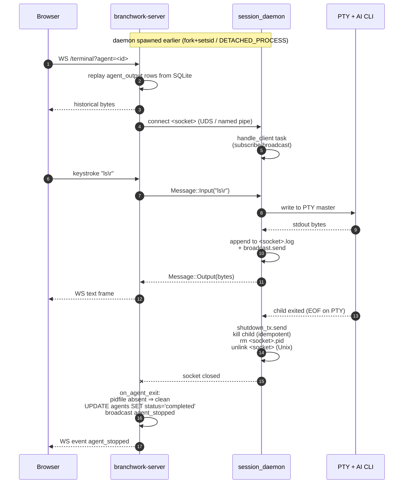

# Architecture: session daemon

The session daemon is the per-agent mini-supervisor that owns one PTY,
one local socket listener, and one on-disk transcript log. There is one
daemon per running agent; the dashboard server and (in SaaS) the
runner attach to it as clients. It is what lets an agent survive a
server restart, reattach a browser tab to a long-running session, and
broadcast the same PTY output to multiple watchers at once.

This page is the focused reference for that one process. For the
cross-binary picture start with [overview.md](overview.md); for the
full session wire format see protocols.md _(stub)_.

## Why a custom daemon (and not tmux)

The first cut of Branchwork shelled out to `tmux new-session -d` per
agent and reattached via `tmux attach`. That worked but came with a
list of papercuts that pushed us to write a tiny supervisor instead:

- **Hard runtime dependency.** tmux had to be on `PATH` of every
  machine running an agent — fine on a Linux dev box, awkward in the
  Alpine-based container image, impossible on Windows runners.
- **No structured IPC.** We were screen-scraping `tmux capture-pane`
  and `tmux send-keys`, which mangled control sequences and made
  resize / kill / keepalive a guessing game. We wanted typed messages.
- **No transcript guarantee.** tmux's history buffer is in-memory and
  capped; once the session went away (or we exceeded the scrollback),
  the bytes were gone. We needed an authoritative on-disk log so a
  late-attaching client always sees the full run.
- **Lifecycle ambiguity.** tmux pane death vs. session death vs.
  server death all looked similar from outside. We wanted a single
  process per agent whose presence (`pidfile_path`) is the truth.
- **Windows.** tmux does not run there. `interprocess` named pipes do.

The replacement lives in
[`server-rs/src/agents/supervisor.rs`](../../server-rs/src/agents/supervisor.rs)
and [`server-rs/src/agents/session_protocol.rs`](../../server-rs/src/agents/session_protocol.rs).
It is ~500 lines, has no runtime dependencies beyond what
`branchwork-server` already links, and works the same way on Linux,
macOS, and Windows.

## Invariants the daemon guarantees

These are the load-bearing properties the rest of the system relies on:

1. **One daemon per agent, lifetime ≥ agent lifetime.** The daemon
   outlives any individual server or browser process. SIGTERM on the
   server does not kill running agents.
2. **The transcript log is the historical record.** Every byte the PTY
   emits is appended to `<socket>.log` and `flush()`ed before the
   broadcast send, so a client that connects after the fact still sees
   what happened. Output emitted before any client subscribed is
   intentionally dropped from the live broadcast — go read the log.
3. **The pidfile is the liveness signal.** The daemon writes its real
   PID to `<socket>.pid` after detaching and removes it as the final
   step of orderly shutdown. Pidfile present after the socket goes
   silent ⇒ supervisor crashed (SIGKILL, OOM kill, panic). Pidfile
   absent ⇒ clean exit. This is faster and more honest than waiting
   for the 45s heartbeat to trip — see
   [`pty_agent::on_agent_exit`](../../server-rs/src/agents/pty_agent.rs).
4. **Reattach is idempotent.** Multiple browser tabs can attach to the
   same agent; each gets its own broadcast subscription. Reconnecting
   after the network drops just opens a new socket — the daemon does
   not care how many clients have come and gone.
5. **One protocol, two transports.** The same length-prefixed
   postcard frames run over Unix domain sockets on Unix and named
   pipes on Windows. Higher layers never see the difference.

## Invocation surfaces

The daemon has exactly one entry point — `supervisor::run_session` —
reached two ways:

| Caller                                 | Command                                                                                                       | Notes                                                                                                                       |
| -------------------------------------- | ------------------------------------------------------------------------------------------------------------- | --------------------------------------------------------------------------------------------------------------------------- |
| Main server / runner                   | `branchwork-server session --socket <path> --cwd <dir> --cols <c> --rows <r> -- <cmd> <args...>`              | Dispatched from `main.rs` **before** the tokio runtime starts, because `fork()` and a multi-threaded runtime do not mix.    |
| Tests, alternate harnesses             | `session_daemon --socket <path> --cwd <dir> -- <cmd> <args...>`                                               | Standalone binary in [`server-rs/src/bin/session_daemon.rs`](../../server-rs/src/bin/session_daemon.rs). Uses `#[path]` to inline the supervisor + protocol modules — no separate library crate. |

Both paths land in `run_session`, which detaches first and then calls
`run_session_in_place` (a current-thread tokio runtime over
`run_daemon`). Tests that drive `run_daemon` directly skip the detach
and run inline.

The arg surface (`SessionArgs`) is intentionally tiny: `--socket`,
`--cwd`, `--cols`, `--rows`, then a `--`-separated argv for the
process to run inside the PTY (typically the chosen AI CLI plus its
flags).

## Detach: Unix vs. Windows

The daemon must keep running after its parent (the server) exits. The
two platforms get there differently:

**Unix.** `detach_from_parent` does the textbook double-detach in a
single fork:

1. `fork()`. The parent `_exit(0)`s immediately so the spawning server
   gets a tidy `SIGCHLD` and never inherits a zombie.
2. The child calls `setsid()` to become a new session leader, severing
   any controlling-terminal association from the spawner.
3. The child redirects stdin/stdout/stderr to `/dev/null` so the
   daemon never holds the invoker's TTY open and stray writes don't
   stall on a closed pipe.

The fork-parent's PID is what `Command::spawn()` returned, but it
exited a millisecond later. The real, durable daemon PID is whatever
the post-`setsid` child has — and the daemon writes that PID to
`<socket>.pid` so the spawner can recover it. `spawn_session_daemon`
polls the pidfile (50 × 100ms) and returns the durable PID once it
appears.

**Windows.** No fork. The parent passes
`CREATE_NO_WINDOW | DETACHED_PROCESS` (`0x0800_0000 | 0x0000_0008`) to
`CreateProcess` via `CommandExt::creation_flags` in `spawn_detached`.
Once the child runs, the OS has already severed the console
association and removed it from the parent's job — `detach_from_parent`
is a no-op. The pidfile dance still applies (it's portable code), but
the spawn-time PID and the durable PID are the same value.

## Local IPC: socket vs. named pipe

The daemon-to-client transport is abstracted through the
[`interprocess`](https://crates.io/crates/interprocess) crate's
`local_socket` module. `socket_name(path)` is the platform shim:

- **Unix:** the path itself is the Unix domain socket file. The daemon
  removes any stale path on bind (a previous crash would otherwise
  trip `EADDRINUSE`) and unlinks it on clean shutdown.
- **Windows:** the basename's stem is turned into
  `\\.\pipe\<stem>`. Named pipes are not file-system-visible, so
  there's nothing to unlink — `ListenerOptions::try_overwrite(true)`
  is documented as a no-op there.

The same `Path` is used to derive four sibling files on both
platforms:

| Path                     | Owner                  | Lifetime                                                                                |
| ------------------------ | ---------------------- | --------------------------------------------------------------------------------------- |
| `<socket>`               | The daemon (listener). | Created on bind, unlinked on clean shutdown (Unix only — named pipes vanish on close).  |
| `<socket>.pid`           | The daemon.            | Written after detach, removed on clean shutdown. **Presence after exit ⇒ crash.**       |
| `<socket>.log`           | The daemon.            | Open-append for the daemon's lifetime, fsync-on-write for every chunk. Survives exit. |
| `<socket>.mcp.json`      | The server (spawner).  | Written by `start_pty_agent` when the driver advertises an MCP config.                  |
| `<socket>.settings.json` | The server (spawner).  | Written by `start_pty_agent` when the driver supplies an unattended-mode hook config (see [Per-session settings file](#per-session-settings-file)); removed best-effort on agent exit, with a `cleanup_and_reattach` sweep for crash leaks. |

Default location is `<sockets_dir>/<agent-id>.{sock,log,pid,mcp.json,settings.json}`
where `sockets_dir` is configurable on `AgentRegistry`; the typical
self-hosted layout puts these under `~/.claude/sessions/` (see
user-guide.md for the full `~/.claude/` tree).

## Wire protocol

The framing is length-prefix (4-byte big-endian `u32`) + postcard
payload, capped at `MAX_FRAME_BYTES = 8 MiB` so a buggy or malicious
peer cannot force unbounded allocation. The `Message` enum has six
variants:

| Variant                      | Direction         | Purpose                                                       |
| ---------------------------- | ----------------- | ------------------------------------------------------------- |
| `Input(Vec<u8>)`             | client → daemon   | Stdin bytes (forwarded to the PTY master).                    |
| `Output(Vec<u8>)`            | daemon → client   | PTY stdout/stderr bytes (broadcast to all attached clients).  |
| `Resize { cols, rows }`      | client → daemon   | Window-size change; forwarded to `MasterPty::resize`.         |
| `Kill`                       | client → daemon   | Terminate the PTY child and shut the daemon down.             |
| `Ping`                       | client → daemon   | Keepalive request.                                            |
| `Pong`                       | daemon → client   | Keepalive response.                                           |

All six variants travel over the same transport in both directions
(the protocol is symmetric on the wire even though most variants are
one-way semantically). For the runner / dashboard wire format, which
is a different protocol entirely, see protocols.md _(stub)_.

## Lifecycle: spawn → attach → exit

### Spawn

1. Server resolves a unique agent id and computes
   `socket_path = sockets_dir/<id>.sock`.
2. Server clears any stale `<socket>.pid` from a previous crashed
   daemon (Unix only).
3. Server calls `spawn_session_daemon(exe, socket, cwd, cols, rows, cmd)`,
   which `spawn_detached`s the platform-appropriate CLI and then polls
   `<socket>.pid` for up to ~5s.
4. Inside `run_daemon` the child:
   - Removes any leftover socket file on Unix.
   - Binds the local socket listener (`ListenerOptions::create_tokio`).
   - Writes its real PID to `<socket>.pid`.
   - Opens the PTY (`portable_pty::NativePtySystem`) and spawns the
     CLI inside it with `TERM=xterm-256color` and the requested cwd.
   - Starts a blocking OS thread reading PTY → log file + broadcast,
     and a second thread draining client-input mpsc → PTY writer.
   - Enters the accept loop.
5. Server reads the durable PID and `INSERT`s the agent row with
   `mode = 'pty'`, `supervisor_socket = <path>`, `pid = <durable-pid>`.

### Attach

A "client" here is anything that opens the local socket and speaks the
framed protocol — typically the dashboard server's
[`pty_agent::connect_and_wire`](../../server-rs/src/agents/pty_agent.rs)
running inside `branchwork-server`, but in SaaS it's the runner doing
the same thing. The daemon does not distinguish them.

On `accept` the daemon spawns a `handle_client` task that:

1. Subscribes to the broadcast (`out_tx.subscribe()`) so the client
   gets every byte from this point forward.
2. Spawns a reader: framed messages from the client → mpsc to the PTY
   writer (`Input`), or direct calls to `MasterPty::resize` (`Resize`)
   / `child.kill()` + shutdown (`Kill`) / immediate `Pong` reply
   (`Ping`).
3. Spawns a writer: every chunk popped off the broadcast becomes an
   `Output` frame on the wire.
4. Both halves race; first to fail aborts the other and the task exits.

Multiple attaches at once are normal: the dashboard's WS handler
subscribes once per agent, and the broadcast channel fans the same
PTY chunk out to every subscriber. Late subscribers do not see
historical bytes from the broadcast — they replay from the on-disk
log instead (see below).

### Reconnect / replay across server restarts

When the dashboard server restarts, every PTY-mode agent row in
`running|starting` goes through `cleanup_and_reattach`:

1. If the row has no `supervisor_socket` recorded, mark orphaned.
2. If `process_alive(pid)` is false, mark orphaned.
3. Otherwise call `reattach_agent` → `connect_and_wire`. A successful
   socket connect re-registers the in-process `ManagedAgent` (output
   broadcast + command channel) and spawns the heartbeat task.

The historical transcript is replayed from two sources, in order, by
[`terminal_ws::handle_terminal`](../../server-rs/src/agents/terminal_ws.rs)
when a browser opens the terminal panel:

1. The `agent_output` table in SQLite (every `Output` chunk the server
   ever observed for this agent, persisted as it arrived).
2. The live broadcast from this point forward.

If the server has restarted but the agent itself is alive, the WS
handler injects a yellow banner — `--- terminal detached (server
restarted while agent was running) ---` — so the user knows the
historical bytes between the crash and the reattach are recoverable
from `<socket>.log` on disk but were not captured in `agent_output`.
Stream-JSON-mode agents (check agents) cannot reattach at all because
the server held their stdin/stdout directly; those rows are always
marked orphaned on boot.

### Broadcast fan-out

`tokio::sync::broadcast::channel::<Vec<u8>>(1024)` inside the daemon
is what makes multiple-client attach cheap: a single PTY read is
copied once to the log file and once into the broadcast, then any
number of subscribed `handle_client` tasks each receive their own
clone. The 1024-frame buffer is per-subscriber: a slow client gets a
`RecvError::Lagged` and the writer task simply skips the lag and
continues, dropping frames for that subscriber only. The slow client
recovers full state from the on-disk log on its next reconnect.

### Exit and cleanup

The daemon has two normal exit paths and one crash path:

- **PTY child exits.** The blocking PTY reader thread sees EOF, sends
  on `shutdown_tx`, and the accept loop breaks. The daemon kills any
  still-running child (idempotent — usually a no-op), removes
  `<socket>.pid`, and on Unix unlinks `<socket>`. The `.log` file
  stays on disk for post-mortem.
- **Client sent `Kill`.** Same path as above, but the kill is forced
  and originated from outside.
- **SIGKILL / OOM kill / panic.** The daemon dies without running its
  cleanup. `<socket>.pid` survives. The next time the server tries to
  finalize the agent row, `pty_agent::on_agent_exit` notices the
  pidfile is still there and writes
  `status = 'failed', stop_reason = 'supervisor_unreachable'`.

The on-disk log is **never** truncated by the daemon. It is the only
record of what the agent actually printed, and it is what makes
post-mortem debugging of crashed agents possible.

## Per-session settings file

For self-hosted unattended auto-mode ([ADR 0003](../adrs/0003-unattended-auto-mode.md))
each agent gets a private `claude` settings file at
`<sockets_dir>/<agent_id>.settings.json` — same naming convention as
the `<agent_id>.mcp.json` sibling. The server writes it before spawn
inside [`start_pty_agent`](../../server-rs/src/agents/pty_agent.rs)
(next to the existing `mcp.json` write at `pty_agent.rs:116`) and
removes it best-effort on agent exit; `cleanup_and_reattach` sweeps
crash-leaked files for orphaned agent rows on startup.

**Insertion point in argv.** The `--settings <path>` flag is appended
inside the driver-built argv, *not* the `branchwork-server session`
argv. Concretely it lands in
[`ClaudeDriver::spawn_args`](../../server-rs/src/agents/driver.rs)
(the `impl AgentDriver for ClaudeDriver` block, around the
`spawn_args` method that today emits `--session-id`, `--add-dir`,
`--verbose`, `--effort`, then the conditional `--dangerously-skip-permissions`,
`--max-budget-usd`, `--mcp-config` arms). The `--settings` arm sits
alongside `--mcp-config` since both are conditional, per-session,
path-valued flags whose path is computed by `start_pty_agent` and
threaded in via `SpawnOpts` (the Claude-specific
`SpawnOpts.settings_path` field is added at the same time as the flag).
The result is a `Vec<String>` that `start_pty_agent` then hands to
[`supervisor::spawn_session_daemon`](../../server-rs/src/agents/supervisor.rs)
verbatim as `cli_cmd` (`pty_agent.rs:146`).

**No shell-escape hazard.** `spawn_session_daemon` builds the daemon
invocation with `Command::new(exe).args(...)` — no `/bin/sh -c`, no
string interpolation. Inside the daemon, `run_daemon` constructs a
`portable_pty::CommandBuilder` (`CommandBuilder::new(&cmd[0])` followed
by one `builder.arg(a)` per remaining element at `supervisor.rs:301-304`)
and spawns the CLI with `pair.slave.spawn_command(builder)` —
`execve`-style spawn, one element per argv slot. A settings path
containing spaces, quotes, backslashes, or other shell metacharacters
is therefore handled correctly without any escaping on the producer
side. This is the same property the existing `--mcp-config` and
`--add-dir` flags already rely on.

**Scope: standalone only.** The runner-side spawn path
([runner.md → Spawning agents](runner.md#spawning-agents-and-reusing-the-session-daemon))
constructs its own `claude` argv and would need a separate plumbing
pass to honour the settings file — see ADR 0003's
"Scope: standalone only" subsection and the saas-compat-* backlog.

For the full unattended-mode contract — file lifecycle, settings
contents (a single `Stop` hook posting to `http://localhost:<port>/hooks`),
and the auto-finish gate that runs in `hooks.rs::receive_hook` — see
[ADR 0003](../adrs/0003-unattended-auto-mode.md).

## Sequence: attach → type → exit

## See also

- [overview.md](overview.md) — the three-binary diagram, the persistence table, and the end-to-end Start-task walkthroughs.
- [server.md](server.md) — `cleanup_and_reattach`, `AgentRegistry`, and how the dashboard fits the supervisor into its lifecycle.
- [ADR 0003](../adrs/0003-unattended-auto-mode.md) — full contract for the per-session settings file (Stop-hook payload, lifecycle, scope).
- protocols.md _(stub)_ — full session frame format, runner WireMessage tagged union, hook POST shape, dashboard WS event vocabulary.
- [`server-rs/src/agents/supervisor.rs`](../../server-rs/src/agents/supervisor.rs), [`session_protocol.rs`](../../server-rs/src/agents/session_protocol.rs), [`bin/session_daemon.rs`](../../server-rs/src/bin/session_daemon.rs) — the canonical implementation.
